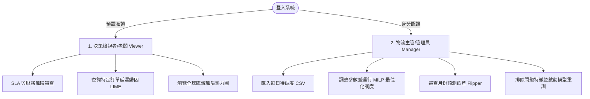

# EDIS 物流延遲預測與最佳化調度系統：UI/UX 暨系統架構分析報告

本報告從**資深 UI/UX 工程師**與**系統架構師**的雙重視角出發，深入解析現行 EDIS 系統在使用者操作流程（User Flow）中的核心痛點，並結合系統層面的資料流與安全機制進行架構層面的審計。

---

## 1. 使用者角色與核心流程定義 (User Personas & Key User Flows)

為了精確評估系統流程，我們將主要使用者區分為兩大角色：



### 角色 1：決策檢視者 / 高階主管 (Viewer / Executive / Boss)
*   **核心痛點**：需要快速掌握物流營運的整體財務曝險與服務水準（SLA）健康度，並理解「哪些訂單會延遲？」、「原因為何？」及「如何決策？」，而不需要理解複雜的特徵工程與整數規劃細節。
*   **關鍵流程**：
    1.  開啟系統，閱讀 Dashboard 頂部 KPI 卡片（掌握待處理訂單、預期罰金損失）。
    2.  瀏覽「高階經理人建議動作」與「預算情境比較」，決定公司應投入多少物流預算。
    3.  在「老闆直觀問答區」檢視判定延遲的訂單，點擊查看個別訂單的 LIME 本地可解釋性歸因（Local Attribution）。
    4.  在「區域風險地圖」瀏覽全球各地區延遲機率，做為未來供應鏈網絡規劃的依據。

### 角色 2：物流主管 / 系統調度專員 (Logistics Manager)
*   **核心痛點**：需要匯入待調度訂單、模擬物流預算上限，並排除偶發外部事件（如颱風）或排除特定漂移特徵來重訓模型，以維護預測的準確度。
*   **關鍵流程**：
    1.  進入角色切換，輸入密碼登入 `Logistics_Manager`。
    2.  下載範本並匯入最新的待調度訂單 CSV.
    3.  設定預算上限、單筆升級成本與罰金，執行「最佳化調度」，產生建議升級運送的訂單清單（SLA 救回清單）。
    4.  定期在「最佳化調度」頁面追蹤「月份延遲誤差追蹤（Monthly Flipper）」。
    5.  對誤差超出臨界值（例如 5%）的月份進行診斷，排除特定特徵（如運送模式）並執行重訓。
    6.  評估新舊模型指標，決定是否採用（Adopt）或捨棄（Discard）新模型。

---

## 2. UI/UX 互動層面問題分析 (Senior UI/UX Engineer Audit)

### 痛點 A：最佳化入口重複且運算參數脫節 (Inconsistent Optimization Entrypoints)
*   **現狀問題**：
    *   系統在兩個不同頁面都提供了最佳化計算。
    *   **入口一（Dashboard 頁的「經理調度模擬區」）**：物流主管可在此輸入 Budget，但點擊「執行最佳化調度」時，後端呼叫的 Upgrade Cost 固定為 `$80`、Delay Penalty 固定為 `$250`。
    *   **入口二（Optimization 頁的「調度參數量化調整」）**：物流主管可以自由自訂 Upgrade Cost 與 Delay Penalty。
*   **UX 影響**：這會造成極大的認知困擾。使用者在首頁模擬出的結果，會與在最佳化頁面輸入自訂參數後的結果截然不同，且首頁的控制項未向使用者提示其參數已被硬編碼，破壞了「單一事實來源（Single Source of Truth）」的設計原則。

### 痛點 B：動態閾值（Threshold）與最佳化引擎篩選機制脫節 (Decoupled Threshold Interaction)
*   **現狀問題**：
    *   首頁頂部提供了一個「延遲判定門檻值（Threshold Slider）」（預設 0.50）。滑動此滑桿會立刻過濾「老闆問答區」的表格（只顯示 `p_late >= threshold` 的訂單）。
    *   然而，物流主管點擊首頁「執行最佳化調度」或最佳化頁面的「開始計算最佳化調度方案」時，後端 `optimizer.py` 的候選訂單篩選條件是固定讀取 `risk_threshold = 0.3`。
*   **UX 影響**：嚴重的不一致。主管在問答區只看到 5 筆預估延遲的訂單（因為將門檻拉高到 0.70），但點擊最佳化後，卻推薦了 25 筆訂單升級（因為最佳化引擎依然在使用 0.30 門檻）。這讓主管懷疑系統的邏輯是否出錯。

### 痛點 C：跨頁面重定向破壞診斷與重訓的上下文 (Context-Breaking Tab Jumping)
*   **現狀問題**：
    *   使用者在「最佳化調度」頁面下方的 Monthly Flipper 發現某月份誤差過大，點擊「診斷」打開 Modal，進行「排除問題特徵 -> 開始重訓」。
    *   重訓完成後，系統會自動切換到「模型效能」頁面，並在最下方顯示「模型重訓比對結果」（採用/捨棄）。
*   **UX 影響**：這種強制跨頁跳轉（Tab Jumping）中斷了使用者的工作流。使用者在「最佳化調度」頁面啟動診斷，卻在「模型效能」頁面結束流程。當點擊「採用」後，使用者仍停留在「模型效能」頁，必須手動點回「最佳化調度」才能確認該月份的 Flipper 是否順利變回綠色（正常範圍），使用者失去了原本診斷時的對比上下文。

### 痛點 D：耗時任務（模型重訓）缺乏非同步反饋與進度指示 (Blocking UI on Long-Running Tasks)
*   **現狀問題**：
    *   模型重訓需要 1-3 分鐘，前端調用同步 API (`/api/retrain`)，此時 UI 僅展示靜態文字 `重訓中，請稍候（可能需要 1-3 分鐘）…`，且關閉了開始按鈕。
*   **UX 影響**：長時間的等待且沒有進度條（Progress Bar）、步驟指示器或日誌串流，會讓使用者產生「瀏覽器凍結」或「系統當機」的錯覺。一旦使用者因焦慮刷新網頁，可能導致連線中斷、任務孤立或重試衝突。

### 痛點 E：關鍵決策資訊（X 因子）被 modal 深度隱藏 (Attribution Information Bottleneck)
*   **現狀問題**：
    *   「老闆問答區」的「主要延遲原因 (X 因子)」在表格內僅以簡單的規則文字表示（例如 "Standard Class (運送天數較長，風險高)"）。
    *   若要查看真正的機器學習預測關鍵特徵（LIME Local Attribution），使用者必須點擊訂單 ID 彈出 `explainModal`，看完後再手動關閉，再去點下一筆。
*   **UX 影響**：資訊獲取路徑（Click Path）過長。若主管有 20 筆訂單需要稽核，必須點擊開關 Modal 達 40 次，產生極高的操作疲勞。

---

## 3. 系統架構與資料流審計 (System Architect Audit)

### 痛點 F：基於本地共享 CSV 的狀態持久化與執行緒安全漏洞 (Shared Disk-State Vulnerability)
*   **現狀問題**：
    *   系統所有預測狀態都高度依賴 `data/processed/predictions.csv` 這一個單一實體檔案。
    *   物流主管上傳新的 CSV (`/api/upload`) 時，會直接使用 Pandas 將其轉寫覆蓋該 `predictions.csv`。
*   **架構缺陷**：
    1.  **併發衝突 (Race Conditions)**：多使用者情境下，若主管 A 正在跑最佳化，主管 B 上傳了新的檔案，主管 A 的結果將被主管 B 的資料覆蓋。
    2.  **缺乏多租戶隔離 (Multi-Tenancy)**：所有 Viewer 與 Manager 共享同一個狀態檔案，無法支援多用戶並行操作。
    3.  **同步讀寫損毀**：在執行 I/O 寫入的瞬間，若另一個併發讀取請求進來，容易產生資料損毀或引發作業系統檔案鎖定異常（PermissionError / FileLockError）。

### 痛點 G：同步執行 CPU 密集型任務導致事件迴圈阻塞 (Blocking Event Loop by Sync CPU Tasks)
*   **現狀問題**：
    *   FastAPI 採用單執行緒事件迴圈（Event Loop）處理非同步請求。
    *   然而 `/api/retrain` 與 `/api/optimize` 端點中，雖然定義為 `async def`，但內部卻直接以同步執行緒調用了 CPU 密集型任務：
        ```python
        # app.py 中的 retrain_model 同步執行了 preprocessor 和 model 訓練
        result = retrainer.run(excluded_features=body.excluded_features)
        ```
*   **架構缺陷**：
    *   當主管 A 點擊重訓，整個 FastAPI 服務的事件迴圈將被此 Python 執行緒完全鎖定 1-3 分鐘。這段期間，**任何其他使用者發送的任何請求（包括簡單的 /api/metrics 或 /static/index.html 載入）都將被完全掛起，直到重訓結束**。

### 痛點 H：無 Token 驗證的 RBAC（偽安全性設計）(Tokenless Role-Based Access Control)
*   **現狀問題**：
    *   系統在 `/api/optimize` 與 `/api/retrain` 端點中進行了角色校驗，其核心邏輯如下：
        ```python
        role = get_role(x_role) # 從 Header 中的 X-Role 取得
        require_manager(role)   # 判斷是否為 "Logistics_Manager"
        ```
    *   然而，這個 `X-Role` 僅是一個純文字 Header，並無綁定任何經過伺服器簽署的安全憑證（如 JWT 或 Session Token）。
*   **架構缺陷**：
    *   **防禦性極差**：任何人都可以繞過前端登入 Modal，直接使用 `curl -H "X-Role: Logistics_Manager" -X POST ...` 呼叫 API 執行敏感的重訓與最佳化求解操作。這在生產環境中屬於嚴重的安全漏洞（Broken Access Control）。

### 痛點 I：前端 Slider 與後端 Solver 的參數不對齊 (Parameters Mismatch)
*   **現狀問題**：
    *   `/api/optimize` 的 `OptimizeRequest` Pydantic 模型只定義了 `budget`, `upgrade_cost`, `delay_penalty`，沒有提供 `risk_threshold` 參數輸入。
    *   因此，前端的 `threshold` 滑桿只能影響 API 的 `/api/predict`（展示層），而無法將此業務決策指標向下傳遞給 `ShippingOptimizer`，導致決策算法與介面設定脫節。

---

## 4. 系統改良方案與架構設計

為了解決上述 UI/UX 與架構痛點，我們提出以下優化目標與重構建議：

### 4.1 改良前後使用者操作流程對比

| 操作情境 | 現行流程（痛點） | 建議改良流程（優化目標） |
| :--- | :--- | :--- |
| **參數調整與調度模擬** | 在兩個頁面分別設定，首頁硬編碼、最佳化頁自訂，結果不對齊。門檻值滑桿只影響表格，不影響最佳化算法。 | **統一設定中心**：Dashboard 設有「全局調度決策模型」，滑動 Slider 時，Slider 值（`threshold`）會與 `risk_threshold` 自動綁定，並做為參數傳遞給 MILP 求解器。 |
| **個別訂單延遲原因稽核** | 必須點進 Modal 查看細節，看完關閉再點下一筆，操作繁瑣。 | **抽屜式展開 / 嵌入式氣泡**：Boss 問答表支援行展開（Expandable Rows），可直接在表格內嵌入顯示 LIME 原因，大幅減少點擊。 |
| **模型診斷與重訓** | 月份 Flipper 診斷 -> 執行重訓 -> **強制自動跳轉到另一頁** 決定是否採用 -> 手動切回原頁面看結果。 | **就地沙盒診斷流 (Sandbox Mode)**：診斷與重訓直接在 Flipper 對應月份卡片就地打開抽屜視窗，完成後直接在該視窗比對指標，確定 Adopt 後，Flipper 卡片就地由橘變綠，不進行頁面切換。 |
| **重訓等待反饋** | 靜態文字等待 3 分鐘，容易超時或刷新，引發系統衝突。 | **非同步輪詢機制**：API 回傳 Task ID，前端切換為帶有步驟計時的 Progress Bar，並可點擊展開即時 stdout 日誌。 |

### 4.2 建議目標系統架構 (Target System Architecture)

```
[前端瀏覽器 SPA (index.html)]
        |
        +-- (1) 使用者憑證驗證 (JWT Bearer Token)
        +-- (2) SSE / WebSocket 監聽重訓日誌
        |
[FastAPI 後端 API 服務 (app.py)]
        |
        +-- [JWT 驗證中介軟體 (Auth Middleware)]
        |         |-- 驗證 X-Role 與 簽署 Token
        |
        +-- [I/O 隔離層]
        |         |-- 依 session_id 或 user_id 隔離 predictions_[id].csv（多租戶）
        |
        +-- [背景工作執行緒 pool (ThreadPool/Celery)]
                  |-- 非同步執行 PuLP MILP (避免阻塞 Event Loop)
                  |-- 非同步執行 XGBoost 重訓 (並寫入 /api/tasks/{id}/logs)
```

### 4.3 技術重構步驟指引 (Action Items for System Architects)

1.  **非同步任務化 (Asynchronous Task Queue)**：
    *   在 `app.py` 中引入 `from fastapi import BackgroundTasks`。
    *   將 `/api/retrain` 的 `ModelRetrainer.run` 移入 `BackgroundTasks` 或 `concurrent.futures.ThreadPoolExecutor` 中執行，以非同步方式立即回傳 `task_id`，防止事件迴圈被 CPU 任務鎖定。
2.  **多租戶與狀態隔離 (Session Isolation)**：
    *   重構 `predictions.csv` 的讀寫方式。上傳 CSV 時，改為基於 Cookie/Session 或隨機產生 UUID，將資料儲存為 `predictions_[session_id].csv`。
    *   所有 API 端點（`/api/predict`、`/api/optimize` 等）必須透過 Session ID 參數讀取專屬的 CSV，避免併發寫入衝突。
3.  **安全驗證機制機制 (JWT Auth)**：
    *   修改 `/api/login` 回傳一個加密簽署的 `access_token`。
    *   前端收到 Token 後，存入 `sessionStorage`，並在後續請求中帶上 `Authorization: Bearer <token>`。
    *   後端校驗 Token 內的簽章與 Role 聲明，確保 RBAC 不是防禦虛設。
4.  **對齊算法與介面參數 (Parameter Alignment)**：
    *   修改 `OptimizeRequest` Pydantic 模型，新增 `risk_threshold` 欄位。
    *   在 `app.py` 的 `/api/optimize` 端點中，將前端傳入的 `risk_threshold` 傳遞給 `ShippingOptimizer`，對齊演算法與前端視覺元件。
